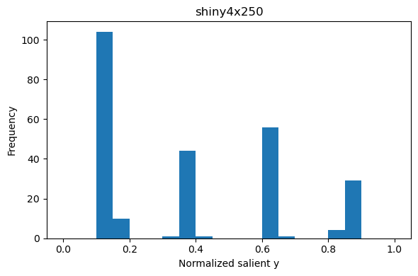
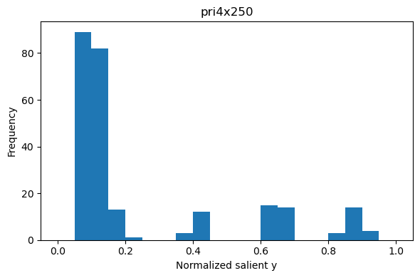
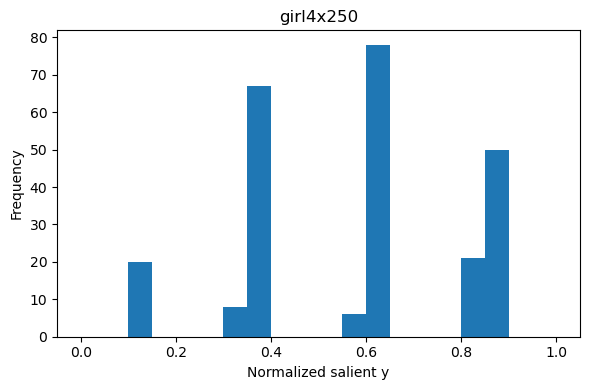
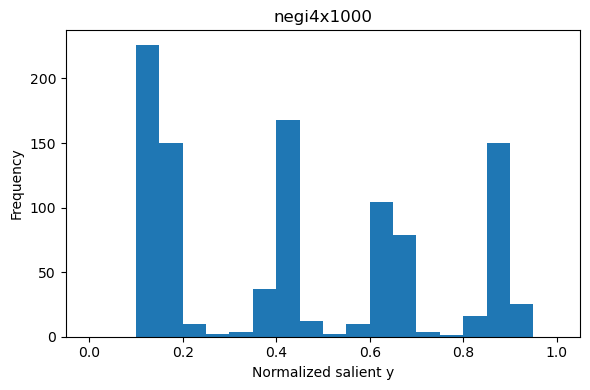

# Manga Image Crop Analysis

## Introduction

Image cropping algorithms should not cause spoilers.
Specifically, they should not reveal the ending and punch line of stories.
If they cause spoilers, they have negative impacts on entertainment, culture, and economy.

We analyze four-frame cartoons and reveal that Twitter's cropping algorithm is biased towards spoilers.
It is inappropriate to crop salient regions to create thumbnails.
We need to develop algorithms that can correctly understand the contents of images and stories.

## Instructions

Install [Miniconda](https://docs.conda.io/en/latest/miniconda.html) or [Anaconda](https://www.anaconda.com/products/individual)

```bash
# create a conda environment
conda env create -f environment.yml
# activate the environment
conda activate image-crop-analysis

# download images to `./data`
python scripts/download.py
# analyze the data
python manga_analysis.py
```

## Datasets

We analyzed four datasets.

| Name       | #Images | Title (en)            | Title (jp)             | Link                                                                                                  |
| ---------- | ------- | --------------------- | ---------------------- | ----------------------------------------------------------------------------------------------------- |
| Shiny4x250 | 250     | Shinymas Everyday!    | シャニマスえぶりでい！ | [Website](https://shinycolors.idolmaster.jp/comic/)/[Twitter](https://twitter.com/imassc_official)    |
| Pri4x250   | 250     | Priconne! Re:Dive     | ぷりこねっ！りだいぶ   | [Website](https://comic.priconne-redive.jp/)/[Twitter](https://twitter.com/priconne_redive)           |
| Girl4x250  | 250     | More! Girls Band Life | もっと！ガルパライフ   | [Website](https://bang-dream.bushimo.jp/special/manga/)/[Twitter](https://twitter.com/bang_dream_gbp) |
| Negi4x1000 | 1000    | negineesan            | ねぎ姉さん             | [Website](http://negineesan.com/)                                                                     |

All the datasets contain vertical four-frame cartoons.
Thus, cropping lower frames (high y coordinate) causes spoilers, revealing the ending and punch line of the episode.

We use these datasets for information analysis, which is permitted by the copyright law of Japan.
Do not use our code to enjoy manga.
You can read them in the websites and twitter.

## Results

We plotted the histogram of salient points' y coordinate normalized by image height.






Although the thumbnails of four-frame cartoons in websites are typically cropped from the first frame
(see [Shiny4x250](https://shinycolors.idolmaster.jp/comic/) and [Girl4x250](https://bang-dream.bushimo.jp/special/manga/)),
Twitter's cropping algorithm is biased towards lower frames.
